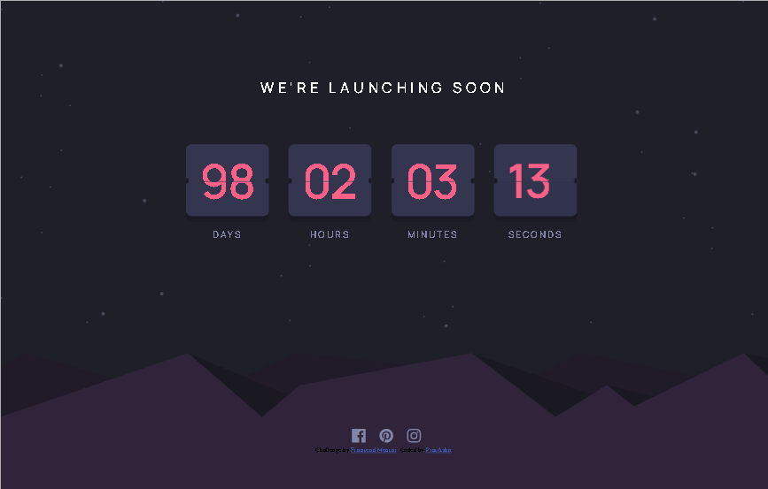

# Launch-Countdown-Timer
This is a launch countdown timer, made using html, css and javascript functions. 

# Frontend Mentor - Launch countdown timer solution

This is a solution to the [Launch countdown timer challenge on Frontend Mentor](https://www.frontendmentor.io/challenges/launch-countdown-timer-N0XkGfyz-). Frontend Mentor challenges help you improve your coding skills by building realistic projects. 

## Table of contents

- [Overview](#overview)
  - [The challenge](#the-challenge)
  - [Screenshot](#screenshot)
  - [Links](#links)
- [My process](#my-process)
  - [Built with](#built-with)
  - [What I learned](#what-i-learned)
  - [Useful resources](#useful-resources)
- [Author](#author)

## Overview

### The challenge

Users should be able to:

- See hover states for all interactive elements on the page
- See a live countdown timer that ticks down every second
- **Bonus**: When a number changes, make the card flip from the middle

### Screenshot



### Links

- Solution URL: [Launch Countdown Timer Solution](https://github.com/Pratiksha1699/Launch-Countdown-Timer)
- Live Site URL: [Launch Countdown Timer Site](https://launch-countdown-timer-pratiksha1699.vercel.app/)

## My process

### Built with

- Semantic HTML5 markup
- CSS custom properties
- CSS Flex 
- Javascript function setTimeout
- Javascript function setInterval 
- CSS media queries
- CSS animation


### What I learned

Initially started with adding and creating the background images and colors. Then created structure for counter then added social media icons, 
Added filter for social media icons, Finally created the effect for flipping page and made it responsive for required device widths. Some new things I have learned while going through 
is mentioned below. Filters for social media icons on hover, folded page creasing effect at the center of each page and making it look like a calender page is what kept me engaging in this project.
 
```css
#facebook-icon:hover,#pinterest-icon:hover,#instagram-icon:hover{
		filter: invert(54%) sepia(56%) saturate(2682%) hue-rotate(311deg) brightness(102%) contrast(97%);
		cursor:pointer;
	}
	
#divider{
		border-bottom:1px solid hsla(236, 21%, 25%,0);
		margin-left:4%;
		width:92%;
		top:50%;
		z-index:5;
		position:absolute;
		box-shadow:0px 1px 1px 0px hsl(236, 21%, 25%);
	}
```
```js
	var sec = ("0" + Math.floor(((bdate-date)%(60*1000))/(1000))).slice(-2);	//required for 2 digit format slice function

```

### Useful resources

- [Box Shadow effect](https://www.w3schools.com/css/css3_shadows_box.asp) - This helped me for creating box shadow effect required for giving creasing effect for div.

## Author

- Frontend Mentor - [@Pratiksha1699](https://www.frontendmentor.io/profile/Pratiksha1699)

